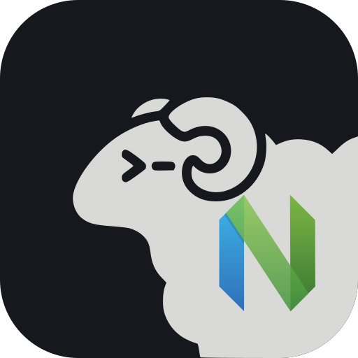

<p align="center">
  
</p>

<h1 align="center">herdr-nvim</h1>

<p align="center">Your <a href="https://herdr.dev">Herdr</a> agents, in Neovim.</p>

> [!NOTE]
> **Unaffiliated project.** herdr-nvim is an independent, community-built Neovim plugin. It is not affiliated with, endorsed by, or supported by Herdr, herdr.dev, or the Neovim project. "Herdr" and "Neovim" are named only to describe what this plugin works with.

Use a [Herdr](https://herdr.dev) session from Neovim like a file tree.
Spaces are folders and terminals/agents are files, with live agent status, and any terminal opens as a Neovim `:terminal`.

- **Tree** - a file-explorer-style view of the session. It borrows its look (icons, indent guides, width, side) from your own file explorer: snacks.nvim's explorer or neo-tree.
- **Picker** - a snacks.nvim picker over spaces and agents with a live, colored preview of each terminal's screen.

Herdr keeps running the agents; Neovim is just another client.
Works with a local Herdr server or one on a remote machine over SSH.

## How it works

Herdr's server exposes two sockets per session:

- `herdr.sock` - the JSON API (one JSON object per line). herdr-nvim uses it for `session.snapshot`, actions like `tab.create` and `pane.rename`, and `events.subscribe` to keep the tree and picker live.
- `herdr-client.sock` - the client protocol. herdr-nvim does not speak it itself: each terminal is `herdr terminal attach <terminal_id>`, which streams one pane's raw terminal output, and Neovim's built-in terminal renders it.

For a remote server, herdr-nvim uses exactly one SSH connection per Neovim, like Herdr's own `herdr --remote`.
If your ssh config has a `ControlPath` for the host and that master is running, it is reused (so hosts that need MFA or a password work: authenticate once with `ssh HOST` in a terminal); otherwise herdr-nvim starts its own master, adding only options your config leaves unset (it never overrides host key checking).
Both sockets are forwarded over it to local unix sockets, and terminals attach with your local `herdr` through the forwarded client socket.
Any number of open terminals costs no extra SSH sessions, and closing one detaches immediately.
Without a local `herdr` (or with one that is not protocol-compatible with the server), terminals fall back to running `herdr terminal attach` on the remote, one SSH session per open terminal.
Herdr is found on the remote in `PATH` (ignoring mise shims), `remote_path`, or the usual install locations (`~/.local/bin`, Homebrew, `/usr/local/bin`, Nix profiles).
If the connection drops (network, SSH master gone, server restarted), herdr-nvim reconnects with backoff (up to 30 s) and reattaches open terminals; `User HerdrDisconnected` / `User HerdrReconnected` fire.

## Requirements

On the machine running Neovim:

- Neovim 0.12+ (CI tests the latest release)
- For a remote server: OpenSSH, with non-interactive access to the host (`ssh -o BatchMode=yes <host> true` must succeed: keys, an agent, or a `ProxyCommand`)
- Recommended: [Herdr](https://herdr.dev) installed locally. Required for a local server; for a remote server it enables the single-connection attach described above
- Optional: [snacks.nvim](https://github.com/folke/snacks.nvim) (picker with live preview, explorer styling) and a [Nerd Font](https://www.nerdfonts.com)

On the remote machine:

- Herdr 0.9.3+ (CI tests the latest release), on `PATH` or in a usual install location (see `remote_path`)
- A Herdr server for the session. herdr-nvim offers to start it when it is not running (`auto_start`)
- SSH unix-socket forwarding allowed (OpenSSH's default `AllowStreamLocalForwarding yes`)

Run `:checkhealth herdr` to check all of this for the current connection.

## Install

[lazy.nvim](https://github.com/folke/lazy.nvim):

```lua
{
  "thomasian06/herdr-nvim",
  opts = {
    -- remote = "devbox", -- SSH target running the Herdr server; omit for a local server
    -- session = "main",
  },
}
```

Other plugin managers: add `thomasian06/herdr-nvim` and call `require("herdr").setup({})`.

### Options

Defaults shown; set only what you change.
Every key is configurable: key tables map a key to an action name, `false` disables a default, and `{ "action", mode = { "n", "i" } }` picks the modes.
Your keys merge with the defaults.

```lua
require("herdr").setup({
  remote = nil, -- optional SSH target offered as a profile (nothing connects automatically)
  session = "main", -- session for `remote`
  profiles = {}, -- e.g. { { name = "devbox", remote = "devbox", session = "main", projects_dir = "~/projects" } }
  projects_dir = nil, -- where new spaces start on the server ("~" = server home); profiles can override
  status_style = "herdr", -- follow Herdr's [ui] status_indicators, or "dots" / "symbols"
  mark_seen = "local", -- viewing a finished agent marks it seen: "local", or "herdr" to also tell Herdr
  auto_start = "ask", -- start a missing Herdr server: "ask" | true | false
  remote_attach = "auto", -- "auto" (local herdr via forwarded socket when possible) | "ssh"
  herdr_bin = "herdr", -- local herdr binary
  remote_path = { "$HOME/.local/bin" }, -- prepended to PATH on the remote

  -- Global keys (false disables one, or all with `keymaps = false`)
  keymaps = {
    toggle = "<leader>aa", -- toggle the tree
    pick = "<leader>ap", -- spaces/agents picker
    connect = "<leader>ac", -- connect to a server/profile
    new_space = "<leader>an", -- create a space and open its terminal
    compose = "<leader>ai", -- compose input for an agent
  },

  tree = { -- unset look options are borrowed from your file explorer
    width = nil, position = nil, icons = nil, indent = nil,
    keys = {
      ["<CR>"] = "open", o = "open", ["<2-LeftMouse>"] = "open",
      l = "expand", h = "collapse",
      s = "vsplit", ["<C-v>"] = "vsplit", S = "split", ["<C-s>"] = "split", t = "tab", ["<C-t>"] = "tab",
      T = "takeover", O = "open_all",
      a = "add", A = "add_space", r = "rename", d = "delete",
      f = "focus", C = "connect",
      z = "collapse_all", Z = "collapse_all", R = "refresh", u = "refresh",
      q = "close", ["?"] = "help", ["g?"] = "help",
    },
  },

  picker = { -- snacks.nvim picker (insert and normal mode)
    keys = { ["<c-v>"] = "vsplit", ["<c-s>"] = "split", ["<c-t>"] = "tab", ["<a-f>"] = "focus" },
  },

  terminal = {
    auto_insert = true, -- entering a herdr terminal window enters terminal mode
    winbar = true, -- status, agent, name and space above each terminal
    keys = {
      ["<Esc>"] = "normal_mode", -- leave terminal mode (not sent to the agent)
      ["<C-h>"] = "nav_left", ["<C-j>"] = "nav_down", ["<C-k>"] = "nav_up", ["<C-l>"] = "nav_right",
      ["<ScrollWheelUp>"] = "history_wheel",
      ["<C-u>"] = "history_half_page", ["<C-b>"] = "history_page", ["<PageUp>"] = "history_page",
      ["<C-y>"] = "history_line", k = "history_up", gg = "history_top",
      ["/"] = "history_search", ["?"] = "history_search_back",
      -- also available: compose (e.g. gi = "compose")
    },
  },

  history = { -- local, cached terminal history
    enabled = true,
    limit = 100000, -- lines kept per terminal
    keys = { i = "live_insert", a = "live_insert", I = "live_insert", A = "live_insert", q = "live", ["<Esc>"] = "live" },
  },

  compose = { -- compose split for agent input
    height = 8,
    keys = {
      ["<CR>"] = "send",
      ["<C-s>"] = { "send", mode = { "n", "i" } },
      ["<C-g>"] = { "paste", mode = { "n", "i" } }, -- into the agent's input, without sending
      q = "close", -- keep the draft
    },
  },

  notify = {
    enabled = true,
    sound = "herdr", -- follow Herdr's [ui.sound] settings; true: always; false: never
    message = true, -- also show a vim.notify message
    on = { done = true, blocked = true },
  },
})
```

For example, with lazy.nvim:

```lua
opts = {
  keymaps = { compose = "<leader>ae" },
  tree = { keys = { x = "delete", d = false } },
  terminal = { keys = { ["<C-l>"] = false, gi = "compose" } }, -- keep <C-l> for the agent
}
```

## Commands

| Command | |
| --- | --- |
| `:Herdr` / `:Herdr toggle` | Toggle the tree |
| `:Herdr pick` | Spaces/agents picker (snacks.nvim; falls back to `vim.ui.select`) |
| `:Herdr open <pane_id>` | Open a terminal, e.g. `:Herdr open w1:p1` |
| `:Herdr refresh` | Re-fetch the session snapshot |
| `:Herdr agents` | Open every agent in the session, tiled in a new tab |
| `:Herdr compose` | Compose input for an agent (`<leader>ai`) |
| `:Herdr new-space [name]` | Create a space and open its terminal (`<leader>an`); it starts in `projects_dir` when set |
| `:Herdr connect [profile\|host[:session]]` | Connect to a server; without an argument, pick one |
| `:Herdr disconnect` | Disconnect |
| `:Herdr save [name]` | Save the current connection as a profile |
| `:Herdr forget <name>` | Remove a saved profile |

## Connections

Nothing connects on its own (except a [project config](#project-config)): open the tree and press `C`, or use `:Herdr connect` (`<leader>ac`).
The picker offers:

- the current and last-used connection, and local Herdr
- `profiles` (and `remote`/`session`) from `setup()`
- Herdr's own saved machines (`herdr machine add ...`), so machines set up for Herdr work here too
- profiles saved with `:Herdr save`
- **New connection…**, which asks for an SSH target and session, then offers to save it

Saved profiles live in `stdpath("data")/herdr-nvim/connections.json`.
Switching detaches and closes the previous server's terminals.

### Project config

To connect automatically in a project, use Neovim's own project-local config ([`'exrc'`](https://neovim.io/doc/user/options.html#'exrc')): turn it on in your config with `vim.o.exrc = true`, then add a `.nvim.lua` to the project:

```lua
vim.g.herdr_connection = "devbox" -- a profile name, or "host[:session]"
-- or: vim.g.herdr_connection = { remote = "devbox", session = "main", projects_dir = "~/projects" }
```

Neovim asks you to trust the file the first time (and after it changes); manage that with `:trust`.
herdr-nvim then connects at startup, unless something is already connected.
Neovim 0.12+ also finds `.nvim.lua` in parent directories; 0.10 and 0.11 only look in the directory Neovim starts in.
`require("herdr").connect(...)` works from a `.nvim.lua` too.

## Tree

```
󰒋 devbox:main
├╴󰝰 api-server                         ○
│ ├╴󰚩 api-server  claude               ○
│ └╴ dev server
└╴󰝰 website                            ●
  ├╴󰚩 fix-login  codex                 ●
  └╴󰚩 add-tests  pi                    ✓
```

Herdr tabs are flattened: a tab with a single pane shows as that terminal, and only a tab with split panes becomes a nested group.

| Key | |
| --- | --- |
| `<CR>` / `o` | Open terminal / toggle space |
| `l` / `h` | Expand / collapse (or jump to parent) |
| `s` `<C-v>` / `S` `<C-s>` / `t` `<C-t>` | Open in vsplit / split / new tab |
| `T` | Open, taking over another `terminal attach` of that pane |
| `O` | Open every terminal under the cursor, tiled in a new tab (on the root line: every agent) |
| `a` | Add a terminal to the space under the cursor (on the root line: add a space) |
| `A` | Add a space |
| `r` | Rename |
| `d` | Close in Herdr (confirms) |
| `f` | Focus in Herdr's own UI |
| `C` | Connect to another server/profile |
| `z` / `Z` | Collapse all |
| `R` / `u` | Refresh |
| `q` | Close tree |
| `?` | Help |

Statuses look like Herdr's: yellow `●` working, red `●` blocked, teal `●` done (finished, not seen yet), green `○` idle (finished and seen), gray `·` no agent.
Spaces and split groups show their most important status (blocked > done > working > idle).
Herdr only marks an agent seen when you focus it in Herdr itself, so herdr-nvim also counts viewing its terminal in Neovim (`mark_seen = "local"`); `mark_seen = "herdr"` tells Herdr too (this moves Herdr's focus).
The glyphs follow Herdr's `[ui] status_indicators` (`dots` or `symbols`). `↗` marks terminals attached in this Neovim.
Terminal buffers of panes closed in Herdr are removed automatically.

## Picker

Spaces with their terminals nested underneath, fuzzy-matched on space, name, agent, status and directory.
The preview shows a terminal's current screen with colors (`pane.read`); for a space it lists its terminals.
Stays live while open.

| Key | |
| --- | --- |
| `<CR>` | Open terminal (on a space: its focused terminal) |
| `<Tab>` then `<CR>` | Mark several spaces/terminals and open them all, tiled in a new tab |
| `<C-v>` / `<C-s>` / `<C-t>` | Open in vsplit / split / tab |
| `<A-f>` | Focus in Herdr's own UI |

## herdr:// buffers (Harpoon, sessions, :edit)

Terminal buffers are named `herdr://<host or local>:<session>/<pane>/<label>`.
Opening such a buffer attaches that pane, connecting to its server first if needed (and asking before switching away from another connection).
So [Harpoon](https://github.com/ThePrimeagen/harpoon) marks, `:edit herdr://...`, sessions and buffer pickers work with agent terminals, including after a restart.

## Notifications

Like Herdr itself, herdr-nvim rings when an agent needs input (becomes blocked) or finishes (goes from working to idle), and shows a notification such as "fix-login (codex) is done".
It stays quiet for the agent in the window you are looking at while Neovim has focus.
As in Herdr, a notification waits `[ui.toast] delay_seconds` (default 1) and is re-checked first, so an agent that flickers back to work stays quiet; several agents finishing at once play one sound.
The sounds are Herdr's own, and Herdr's settings apply: `[ui.sound]` (`enabled`, `path`, `done_path`, `request_path`), per-agent `[ui.sound.agents]` (`default` / `on` / `off`; Droid is off by default), `HERDR_DISABLE_SOUND`, and `HERDR_CONFIG_PATH`.
Notifications work whenever you are connected, even with the tree closed.

## bufferline.nvim

To keep buffer tabs to the right of the tree (like with neo-tree or snacks' explorer), add an offset:

```lua
{
  "akinsho/bufferline.nvim",
  optional = true,
  opts = function(_, opts)
    opts.options = opts.options or {}
    opts.options.offsets = opts.options.offsets or {}
    table.insert(opts.options.offsets, { filetype = "herdr", text = "Herdr", highlight = "Directory", text_align = "left" })
  end,
}
```

## Working in agent terminals

- `<leader>ai` (or `:Herdr compose`) opens a compose split for the terminal in the current window, the last terminal you used, or an agent you pick: write the agent's input with full Neovim editing, then `<CR>` (normal mode) or `<C-s>` sends it as one prompt (Herdr's `agent.prompt`: pasted as a block, then submitted; shells get the text plus Enter). `<C-g>` pastes it into the agent's own input without sending; `q` closes and keeps the draft (one per terminal). Terminal buffers themselves stay read-only: normal mode there is for viewing and yanking.
- `<Esc>` leaves terminal mode and is not sent to the agent. Agents that interrupt on `<Esc>` need another interrupt key; for [pi](https://github.com/earendil-works/pi-coding-agent), in `~/.pi/agent/keybindings.json` on the machine running the agents:

  ```json
  {
    "app.interrupt": ["ctrl+c", "escape"],
    "app.clear": ["alt+c"],
    "tui.altScreen.searchClose": ["escape", "ctrl+c"]
  }
  ```

  `app.clear` moves off `ctrl+c` because its second press exits pi. Keeping `escape` too leaves Herdr's own UI unchanged. Set `terminal = { keys = { ["<Esc>"] = false } }` to send `<Esc>` to the agent instead (then leave terminal mode with `<C-\><C-n>`).
- `<C-h/j/k/l>` move between windows straight from terminal mode, and entering a herdr terminal window puts you back into terminal mode, so you can hop between agents and type without leaving terminal mode.
  With [vim-tmux-navigator](https://github.com/christoomey/vim-tmux-navigator) or [smart-splits.nvim](https://github.com/mrjones2014/smart-splits.nvim) installed, the edges continue into tmux (or WezTerm/Kitty) panes.
  Agents no longer receive those keys; disable or remap them in `terminal.keys` if one needs them.
- In normal mode, scrolling up (`<C-u>`, `<C-b>`, `<PageUp>`, `<C-y>`, `k`, `gg`, mouse wheel) or searching (`/`, `?`) opens the terminal's history in a local, read-only buffer with its colors, where scrolling, search and yank are plain Neovim with no network round trips. `i`/`a` return to the live terminal and type; `q`/`<Esc>` return to it.
  In terminal mode the mouse wheel is left to the terminal: Herdr scrolls its own view, and full-screen apps that use the mouse (`htop`, `vim`, some agents) get it.
  A terminal buffer itself only holds the current screen (Herdr repaints it in place), so herdr-nvim keeps a history cache per terminal: the first open loads the latest 1000 lines (the most Herdr returns per read), and while a terminal is attached the cache syncs in the background, so it keeps everything since you opened it. If more output arrives between syncs than Herdr returns, the cache marks the gap.
- Each terminal window's winbar shows its status, agent, name and space, so a grid of agents stays readable.

## Behavior to know about

- Herdr allows one `terminal attach` client per pane. Opening a pane that is attached elsewhere offers to take it over. Herdr's own UI (`herdr` / `herdr --remote`) does not count and can show the same pane at the same time.
- While attached, Herdr resizes the pane to the Neovim window's size and keeps it at that size until you detach.
- Closing the terminal buffer detaches. `Ctrl-B q` inside the terminal also detaches (Herdr's own detach keys).
- In the `ssh` attach fallback, some SSH servers (for example Coder workspaces) keep a remote command running after its local ssh client is killed. herdr-nvim records each remote attach's PID and hangs it up when the buffer closes and on exit, so panes never stay attached behind your back.
- In the `ssh` fallback each open terminal is one SSH session on the shared connection; OpenSSH servers allow 10 by default (`MaxSessions`).

## User events

`User HerdrAttach` and `User HerdrDetach` fire with `data = { buf, pane_id }`.

## Development

```sh
make check        # StyLua + selene + lua-language-server + tests (what CI runs)
make test         # unit, UI and integration tests
make fmt          # format
pre-commit install  # run formatting, lint and type checks on every commit
```

Tools: [StyLua](https://github.com/JohnnyMorganz/StyLua), [selene](https://github.com/Kampfkarren/selene), [lua-language-server](https://github.com/LuaLS/lua-language-server), and [pre-commit](https://pre-commit.com) for the hooks (on macOS: `brew install stylua selene lua-language-server pre-commit`).

Tests use [mini.test](https://github.com/nvim-mini/mini.test).
UI tests run in a child Neovim; integration tests start a real, isolated Herdr server (its own config and state directories, never your sessions) using `HERDR_BIN` or `herdr` on `PATH`, and are skipped without one.

Test dependencies are pinned:

- `tests/versions.json` lists the Neovim and Herdr versions to test against and the plugins the tests use (edit this).
- `tests/deps.lock.json` pins plugin commits and the release URLs and SHA-256 checksums of every Neovim and Herdr version (generated by `make deps-update`).

Everything is downloaded into `.tests/` and verified against the lock.
CI runs the full sweep on Linux and macOS, plus Neovim nightly as a non-blocking early warning.

To try the plugin in isolation: `nvim -u tests/minimal_init.lua` (set `HERDR_REMOTE` for a remote server).

## License

herdr-nvim is MIT licensed.
Some assets come from other projects:

- The logo combines Herdr's ram (Apache License 2.0) with the Neovim logo mark by Jason Long (CC BY 3.0); see `assets/NOTICE`.
- The notification sounds in `assets/sounds/` are Herdr's, used unmodified under the Apache License 2.0; see `assets/sounds/NOTICE`.
